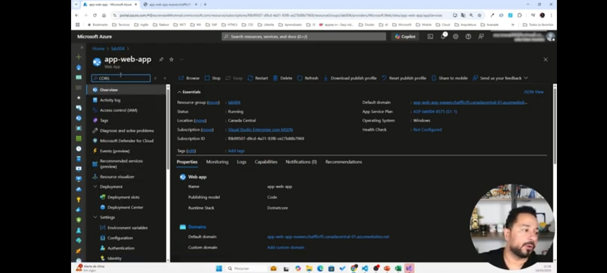

# azure-cloud-native-03
Desafio- API pagamentos
Aprendi a lançar uma API de pagamentos no Azure e como acessá-la usando um token. Aprendi a como criar uma API no Azure e como configurá-la para acessá-la. 

criando APIM (API management)
